# 🌍 Wandrr - Your Ultimate Travel Planning Companion

[](https://flutter.dev/)
[](https://firebase.google.com/)
[](LICENSE)

A comprehensive travel planning app built with Flutter and ❤️, designed to make your travel
experiences seamless and memorable. Wandrr helps you plan, track, and manage every aspect of your
journey - from accommodations and transit to expenses and daily itineraries.

**Available in Light & Dark themes • Supports English, Tamil (தமிழ்) and Hindi (हिंदी)**

---

## ✨ Key Features

### 🏨 **Stays & Accommodations Management**

Keep track of all your lodging arrangements with detailed information including check-in/check-out
times, addresses, and associated costs.

<table>
<tr>
<td width="30%" align="center"><b>📱 Phone View</b></td>
<td width="70%" align="center"><b>📱 Tablet View</b></td>
</tr>
<tr>
<td>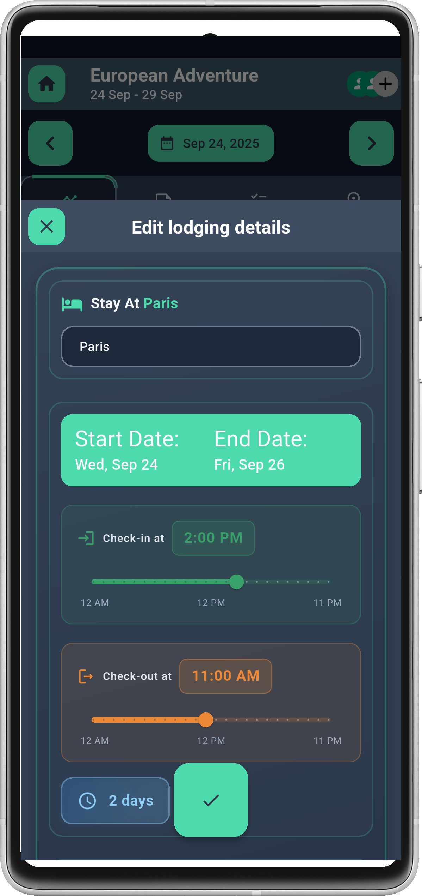</td>
<td>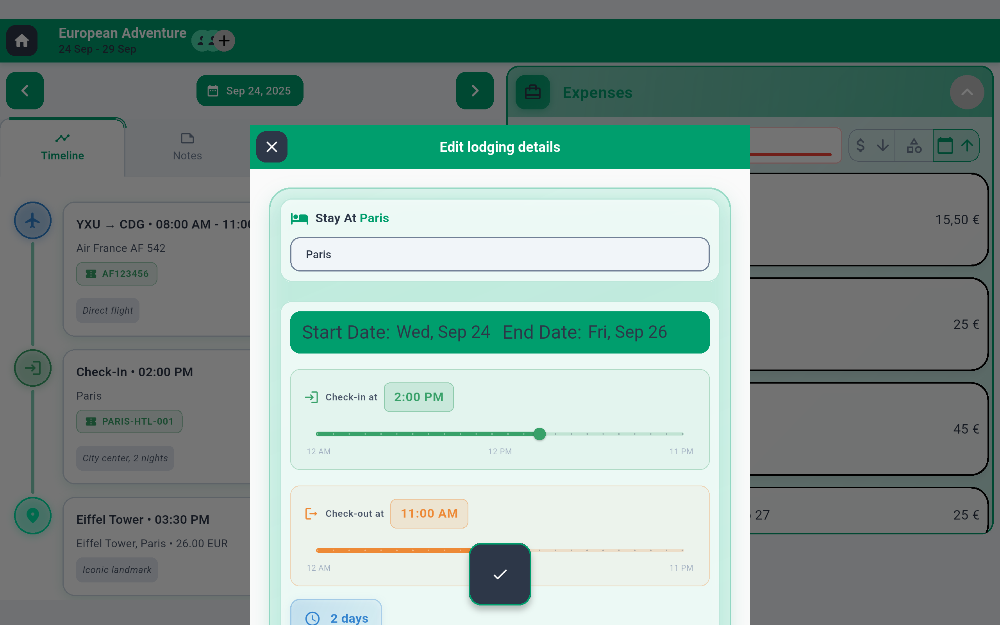</td>
</tr>
<tr>
<td colspan="2" align="center"><i>Manage your accommodations with ease - add check-in/out times, location, and costs</i></td>
</tr>
</table>

---

### ✈️ **Transit & Travel Management**

Plan your journeys with comprehensive transit tracking including flights, trains, buses, and more.
Track carrier information, departure/arrival times, and costs.

<table>
<tr>
<td width="30%" align="center"><b>📱 Phone View</b></td>
<td width="70%" align="center"><b>📱 Tablet View</b></td>
</tr>
<tr>
<td>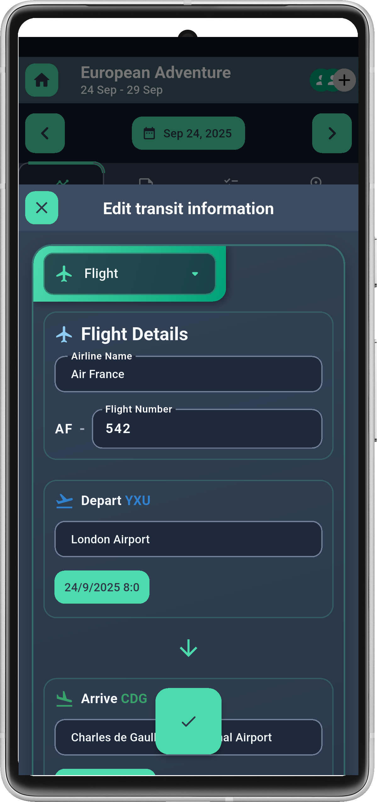</td>
<td></td>
</tr>
<tr>
<td colspan="2" align="center"><i>Add flights, trains, buses, and other transit with detailed scheduling</i></td>
</tr>
</table>

---

### 📋 **Comprehensive Trip Overview**

Get a complete overview of your trip including dates, contributors, budget, and all planned
activities. Manage trip contributors who can collaborate and split expenses.

<table>
<tr>
<td width="30%" align="center"><b>📱 Phone View</b></td>
<td width="70%" align="center"><b>📱 Tablet View</b></td>
</tr>
<tr>
<td>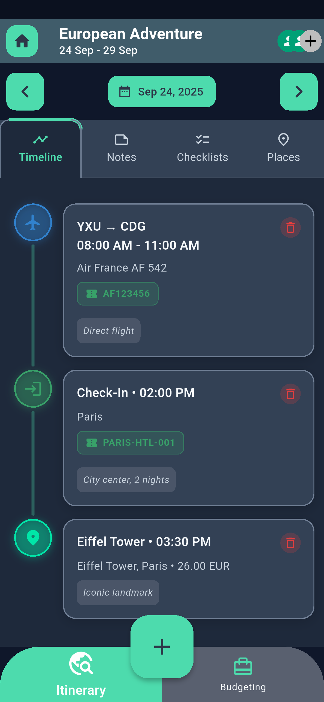</td>
<td>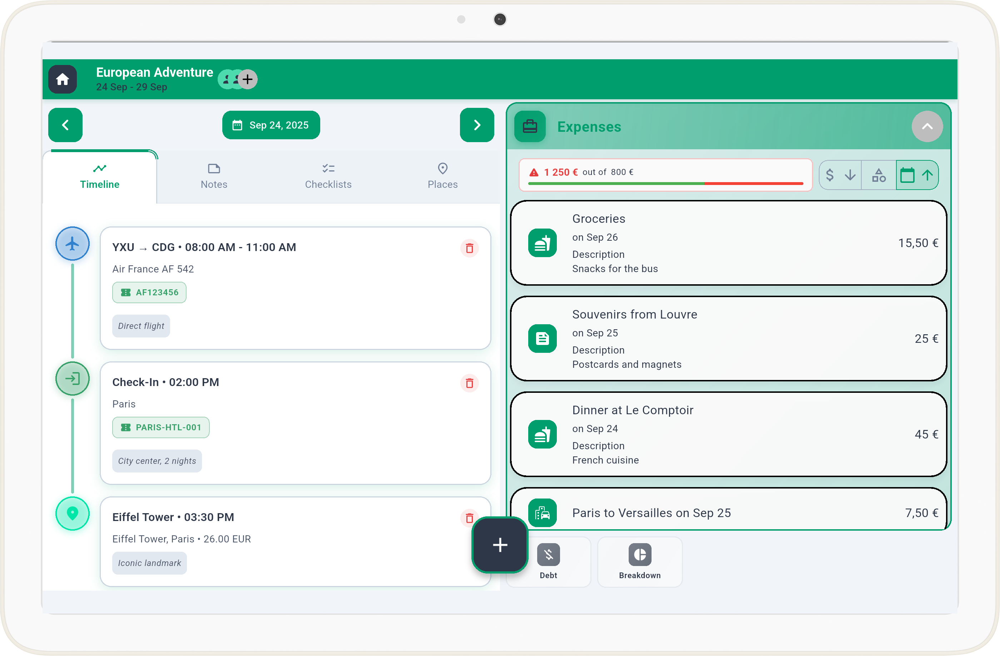</td>
</tr>
<tr>
<td colspan="2" align="center"><i>Manage trip details, add contributors, set budget, and customize your trip thumbnail</i></td>
</tr>
</table>

---

### 📅 **Daily Itinerary Planning**

#### 📝 Notes & Reminders

Add notes and reminders for your trip or specific travel days to keep important information handy.

<table>
<tr>
<td width="50%" align="center"><b>📱 Phone View</b></td>
<td width="50%" align="center"><b>📱 Tablet View</b></td>
</tr>
<tr>
<td>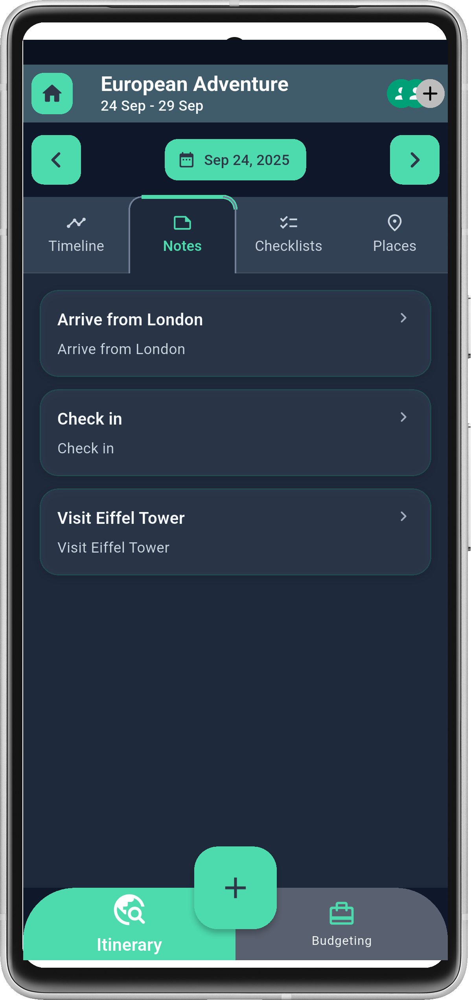</td>
<td>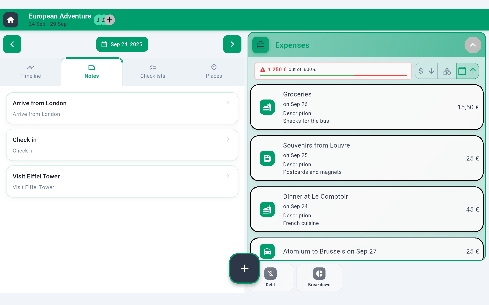</td>
</tr>
<tr>
<td colspan="2" align="center"><i>View and organize notes for each day of your trip</i></td>
</tr>
</table>

<table>
<tr>
<td width="50%" align="center"><b>📱 Phone View</b></td>
<td width="50%" align="center"><b>📱 Tablet View</b></td>
</tr>
<tr>
<td>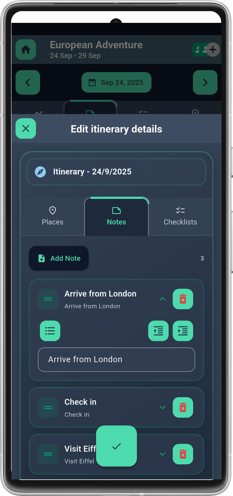</td>
<td>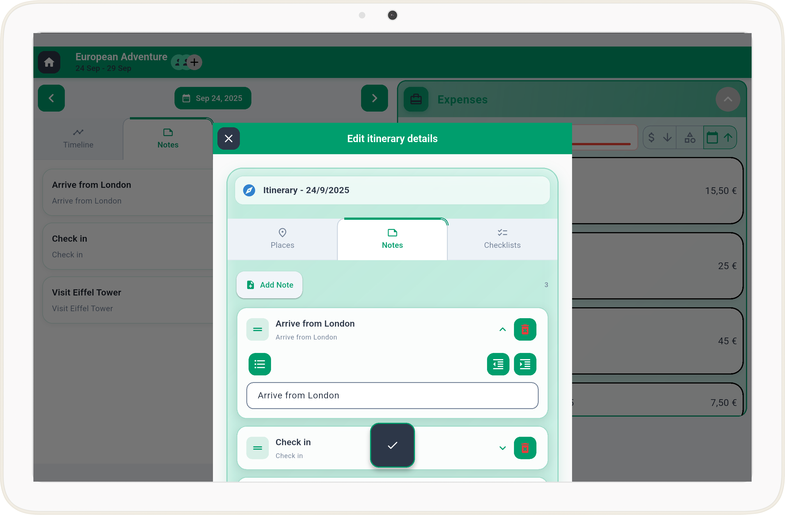</td>
</tr>
<tr>
<td colspan="2" align="center"><i>Create and edit notes with rich text formatting</i></td>
</tr>
</table>

#### ✅ Checklists & To-Do Items

Never forget anything! Create comprehensive checklists for packing, activities, or any
travel-related tasks.

<table>
<tr>
<td width="50%" align="center"><b>📱 Phone View</b></td>
<td width="50%" align="center"><b>📱 Tablet View</b></td>
</tr>
<tr>
<td>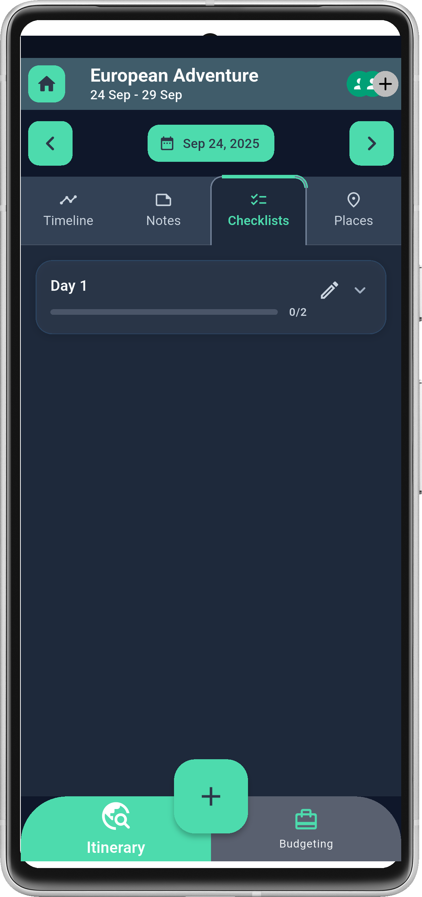</td>
<td>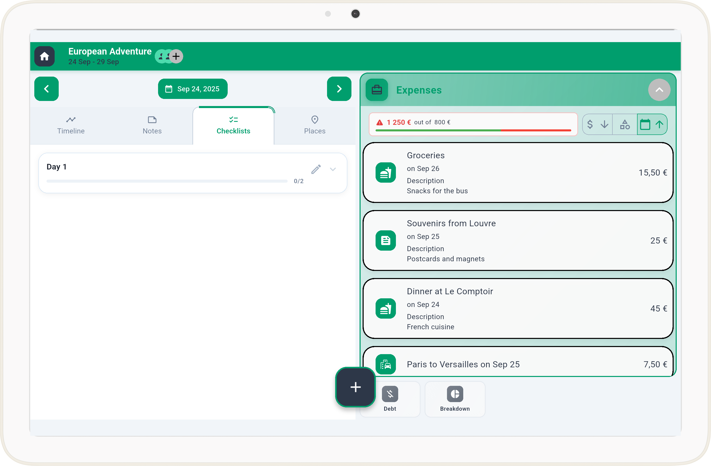</td>
</tr>
<tr>
<td colspan="2" align="center"><i>View and manage your travel checklists</i></td>
</tr>
</table>

<table>
<tr>
<td width="50%" align="center"><b>📱 Phone View</b></td>
<td width="50%" align="center"><b>📱 Tablet View</b></td>
</tr>
<tr>
<td>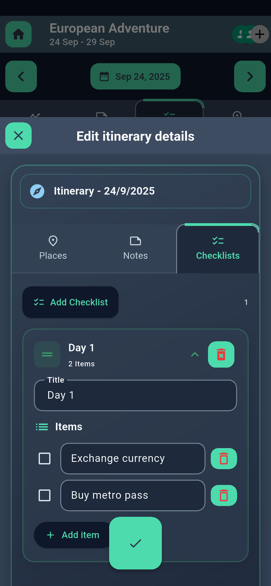</td>
<td>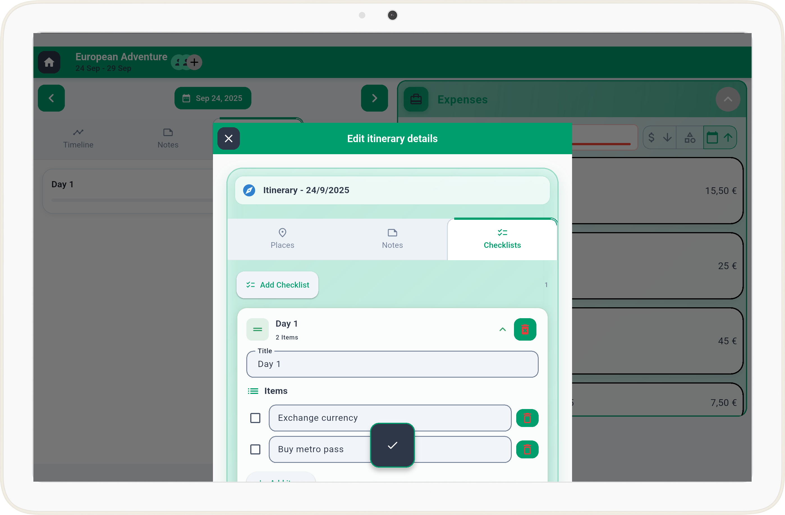</td>
</tr>
<tr>
<td colspan="2" align="center"><i>Create detailed checklists with multiple items</i></td>
</tr>
</table>

#### 🗺️ Places & Sights to Visit

Discover and plan visits to attractions, landmarks, and points of interest during your trip.

<table>
<tr>
<td width="30%" align="center"><b>📱 Phone View</b></td>
<td width="70%" align="center"><b>📱 Tablet View</b></td>
</tr>
<tr>
<td>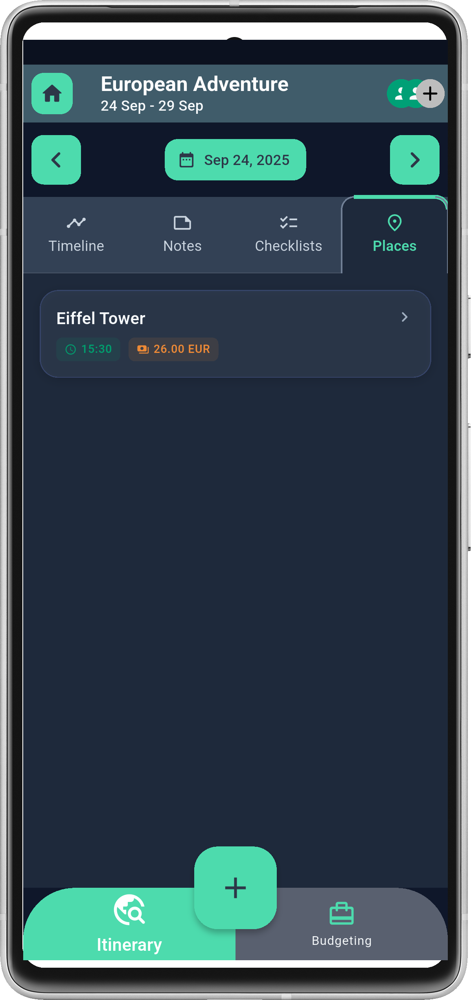</td>
<td>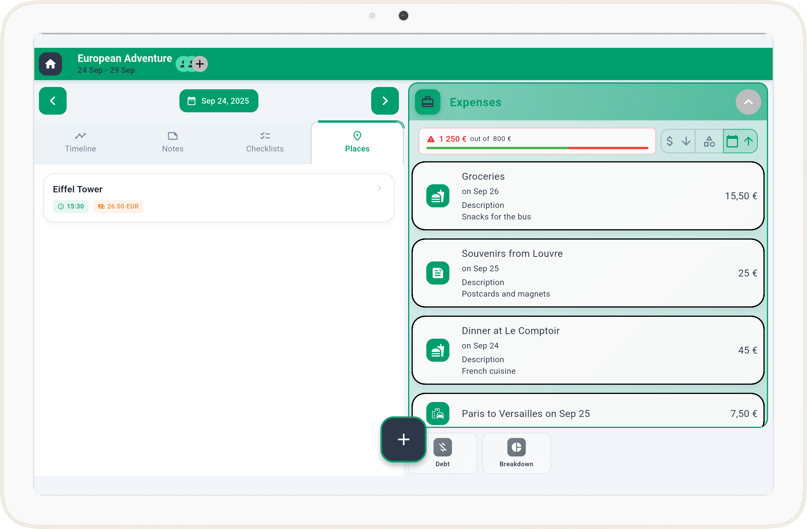</td>
</tr>
<tr>
<td colspan="2" align="center"><i>Browse places you plan to visit</i></td>
</tr>
</table>

<table>
<tr>
<td width="30%" align="center"><b>📱 Phone View</b></td>
<td width="70%" align="center"><b>📱 Tablet View</b></td>
</tr>
<tr>
<td>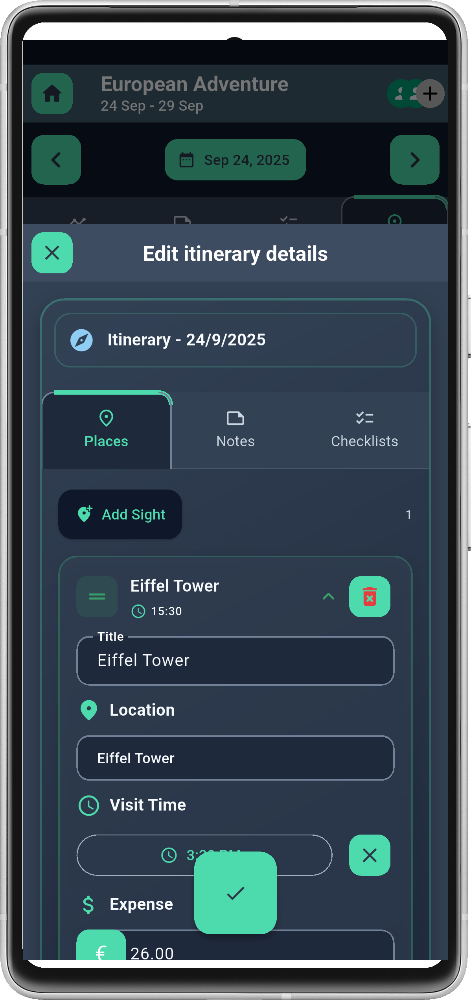</td>
<td>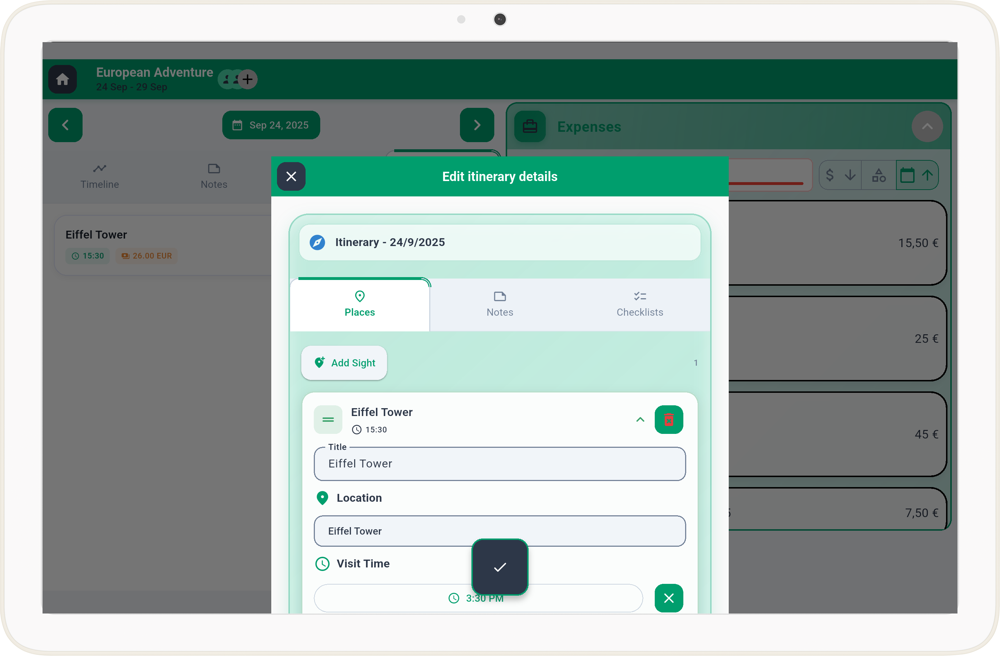</td>
</tr>
<tr>
<td colspan="2" align="center"><i>Add sights with location, timing, and detailed descriptions</i></td>
</tr>
</table>

---

### 💰 **Smart Expense Management**

Track all your travel expenses with detailed categorization and automatic calculation. Perfect for
individual travelers and groups.

#### 💳 Expense Tracking by Date/Category/Cost

View and sort your expenses in multiple ways to get the insights you need.

<table>
<tr>
<td width="30%" align="center"><b>📱 Phone View</b></td>
<td width="70%" align="center"><b>📱 Tablet View</b></td>
</tr>
<tr>
<td>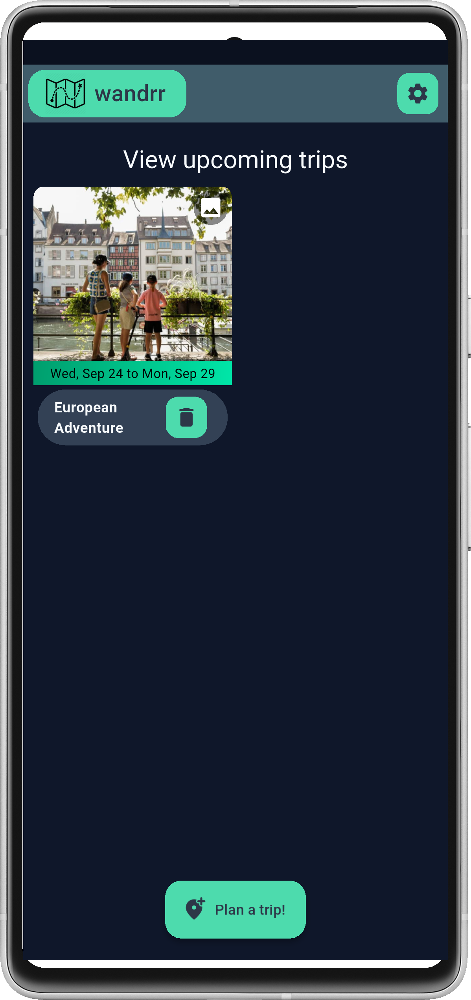</td>
<td>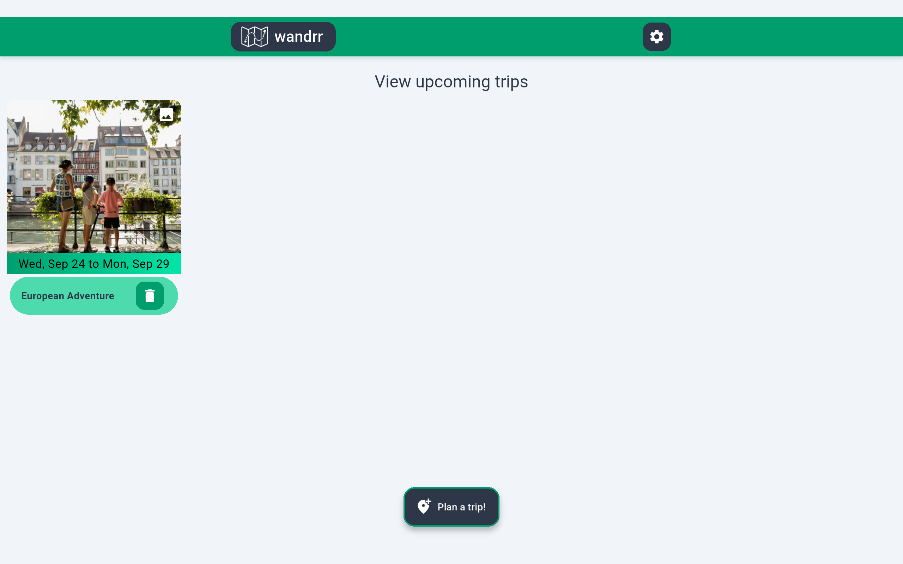</td>
</tr>
<tr>
<td colspan="2" align="center"><i>Your trips dashboard with quick access to all features</i></td>
</tr>
</table>

#### 📊 Budget Breakdown by Day

Visualize how your expenses are distributed across each day of your trip with intuitive charts.

<table>
<tr>
<td width="30%" align="center"><b>📱 Phone View</b></td>
<td width="70%" align="center"><b>📱 Tablet View</b></td>
</tr>
<tr>
<td>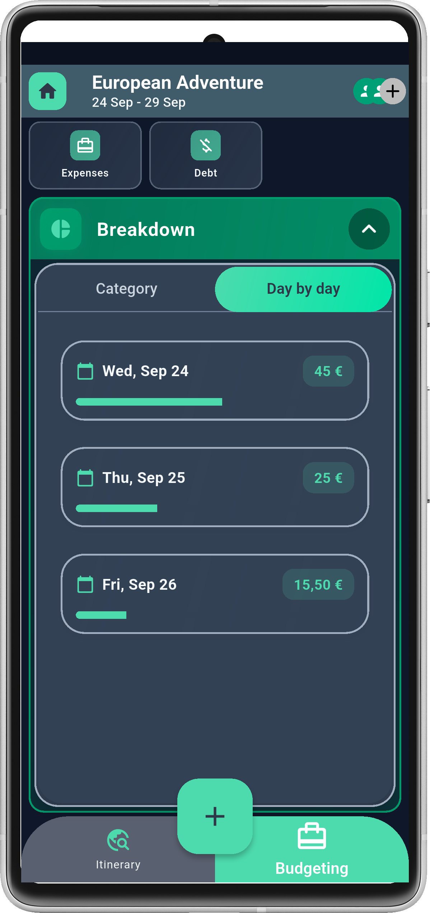</td>
<td>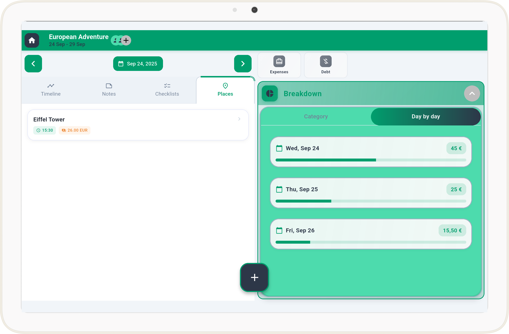</td>
</tr>
<tr>
<td colspan="2" align="center"><i>Analyze your daily spending patterns with visual charts</i></td>
</tr>
</table>

#### 🏷️ Budget Breakdown by Category

Understand where your money goes with category-wise expense analysis (Food, Transport, Activities,
etc.).

<table>
<tr>
<td width="30%" align="center"><b>📱 Phone View</b></td>
<td width="70%" align="center"><b>📱 Tablet View</b></td>
</tr>
<tr>
<td>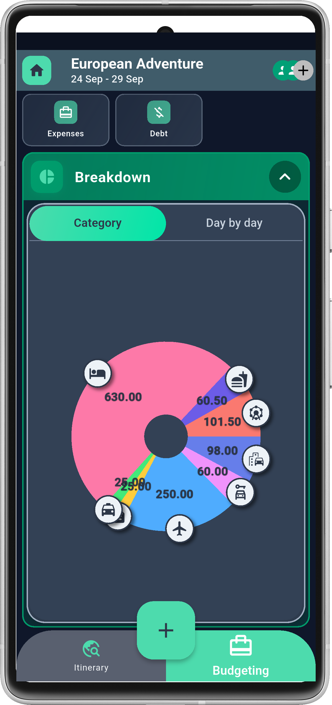</td>
<td>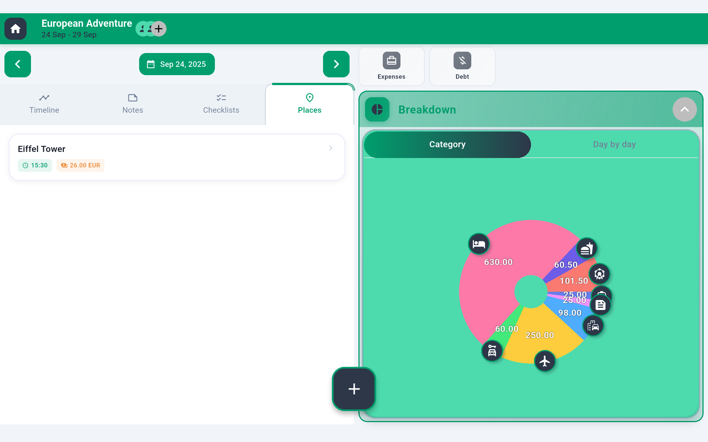</td>
</tr>
<tr>
<td colspan="2" align="center"><i>Track spending by category to stay within budget</i></td>
</tr>
</table>

---

### 👥 **Collaborative Trip Management**

#### Multi-User Support & Expense Splitting

Add multiple trip contributors (all must be registered users) and automatically split expenses among
the group.

#### 💸 Debt Settlement & Balance Tracking

Keep track of who owes whom with automatic debt calculation and settlement tracking.

<table>
<tr>
<td width="30%" align="center"><b>📱 Phone View</b></td>
<td width="70%" align="center"><b>📱 Tablet View</b></td>
</tr>
<tr>
<td>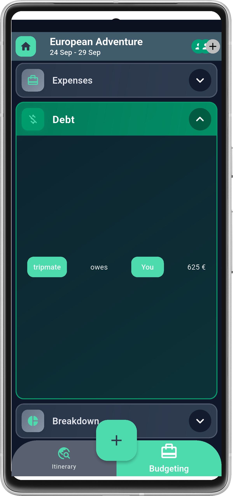</td>
<td>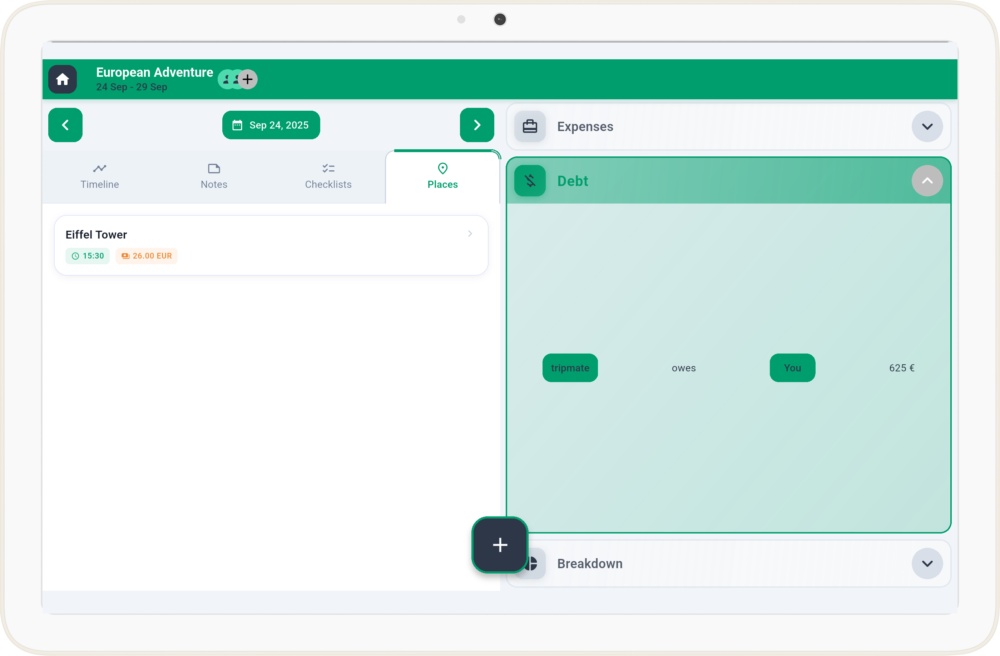</td>
</tr>
<tr>
<td colspan="2" align="center"><i>Clear debt summary showing who owes whom - perfect for group trips</i></td>
</tr>
</table>

---

## 🎯 **Timeline-Based Organization**

Wandrr organizes all time-sensitive activities in an intuitive timeline view:

- **Accommodations** with check-in/check-out times
- **Transit** with departure/arrival schedules
- **Sights & Activities** with planned visit times
- **Expenses** associated with specific dates

This timeline view helps you visualize your entire trip at a glance and ensures nothing overlaps or
gets missed.

---

## 🛠️ **Technical Features**

### 🏗️ Architecture & Stack

- **Framework:** Flutter 3.0+
- **State Management:** BLoC (Business Logic Component) pattern
- **Backend & Database:** Firebase (Firestore, Authentication)
- **Local Storage:** SharedPreferences
- **Authentication:** Email/Password with email verification

### 📱 Cross-Platform & Responsive

- Fully responsive design that adapts to all screen sizes
- Optimized layouts for both phones and tablets
- Consistent experience across Android and iOS

### 🌐 Multi-Language Support

- English
- Hindi (हिंदी)
- Tamil (தமிழ்)
- And more coming soon!

### 🎨 Theming

- Light and Dark mode support
- Customizable color schemes
- Material Design principles

---

## 🚀 Getting Started

### Prerequisites

- Flutter SDK (3.0 or higher)
- Firebase account and project setup
- Android Studio / VS Code with Flutter extensions

### Installation

1. **Clone the repository**
   ```bash
   git clone https://github.com/yourusername/wandrr.git
   cd wandrr
   ```

2. **Install dependencies**
   ```bash
   flutter pub get
   ```

3. **Configure Firebase**
    - Add your `google-services.json` (Android) to `android/app/`
    - Add your `GoogleService-Info.plist` (iOS) to `ios/Runner/`
    - Update `firebase.json` with your Firebase project details

4. **Run the app**
   ```bash
   flutter run
   ```

---

## 📸 Features at a Glance

| Feature                    | Description                                                |
|----------------------------|------------------------------------------------------------|
| 🏨 **Stays Management**    | Track all accommodations with check-in/out times and costs |
| ✈️ **Transit Tracking**    | Manage flights, trains, buses with full scheduling         |
| 📅 **Daily Itinerary**     | Plan each day with notes, checklists, and sights           |
| 💰 **Expense Tracking**    | Log and categorize all trip expenses                       |
| 📊 **Budget Analytics**    | Visualize spending by day and category                     |
| 👥 **Collaborative Trips** | Add multiple contributors and split expenses               |
| 💸 **Debt Settlement**     | Automatic calculation of who owes whom                     |
| 🌍 **Multi-Language**      | Support for English, Hindi, Tamil, and more                |
| 🎨 **Dark Mode**           | Easy on the eyes, day or night                             |
| 📱 **Responsive Design**   | Perfect on phones and tablets                              |

---

## 🤝 Contributing

We welcome contributions! Please feel free to submit a Pull Request. For major changes, please open
an issue first to discuss what you would like to change.

1. Fork the Project
2. Create your Feature Branch (`git checkout -b feature/AmazingFeature`)
3. Commit your Changes (`git commit -m 'Add some AmazingFeature'`)
4. Push to the Branch (`git push origin feature/AmazingFeature`)
5. Open a Pull Request

---

## 📝 License

This project is licensed under the MIT License.

---

## 📧 Contact & Support

Have questions or suggestions? Feel free to reach out!

- **Issues:** [GitHub Issues](https://github.com/ramanan-ramesh/wandrr/issues)
- **Discussions:** [GitHub Discussions](https://github.com/ramanan-ramesh/wandrr/discussions)

---

## 🙏 Acknowledgments

- Flutter team for the amazing framework
- Firebase for backend services

---

<div align="center">

**Made with ❤️ and Flutter**

⭐ Star us on GitHub — it motivates us a lot!

[Report Bug](https://github.com/yourusername/wandrr/issues) · [Request Feature](https://github.com/yourusername/wandrr/issues)

</div>
